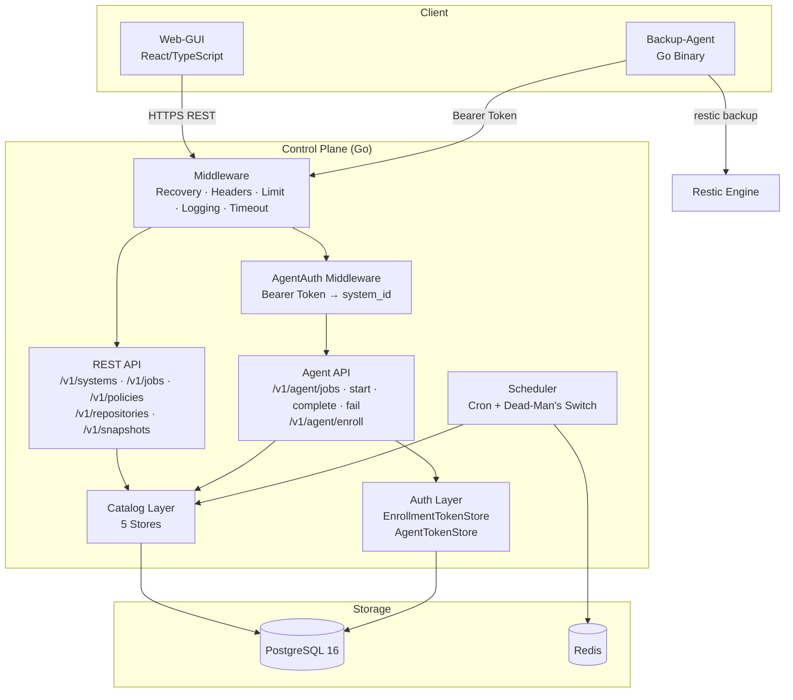
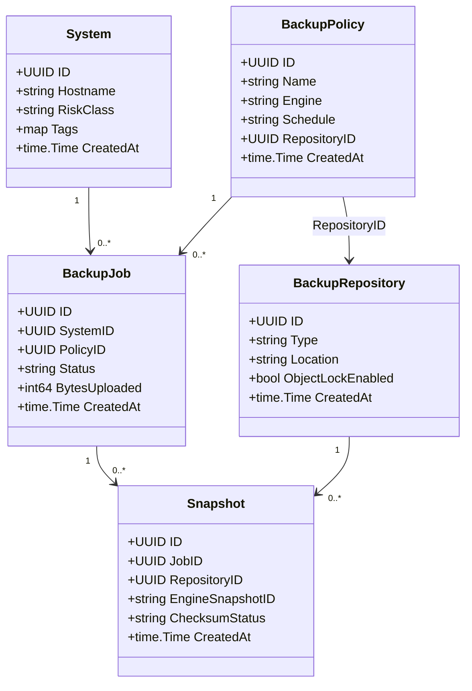
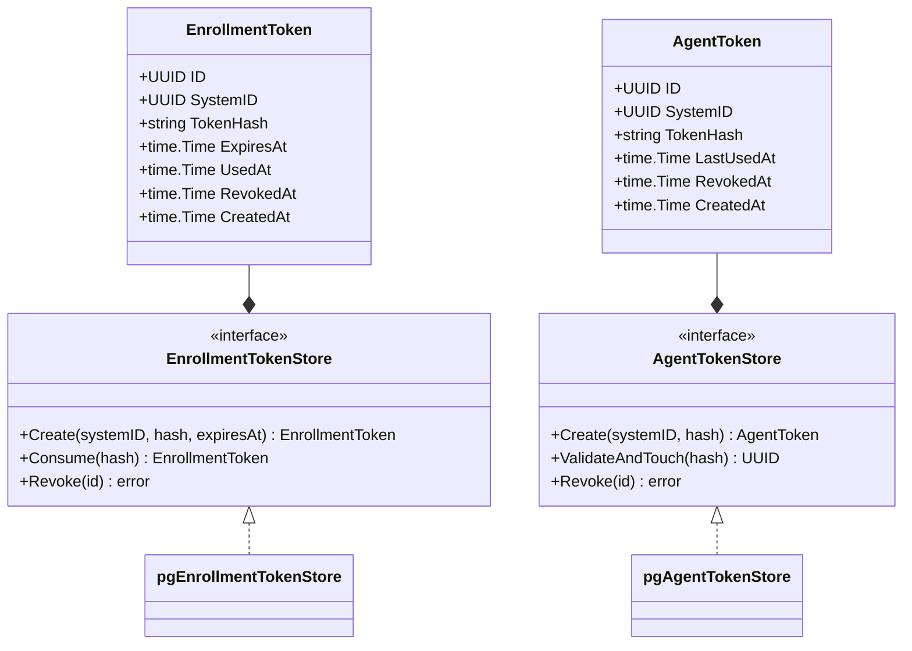
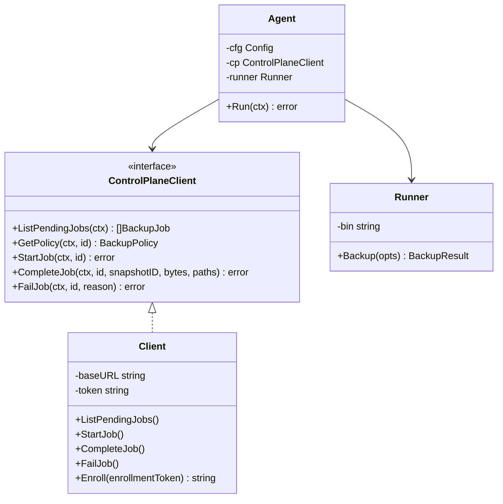
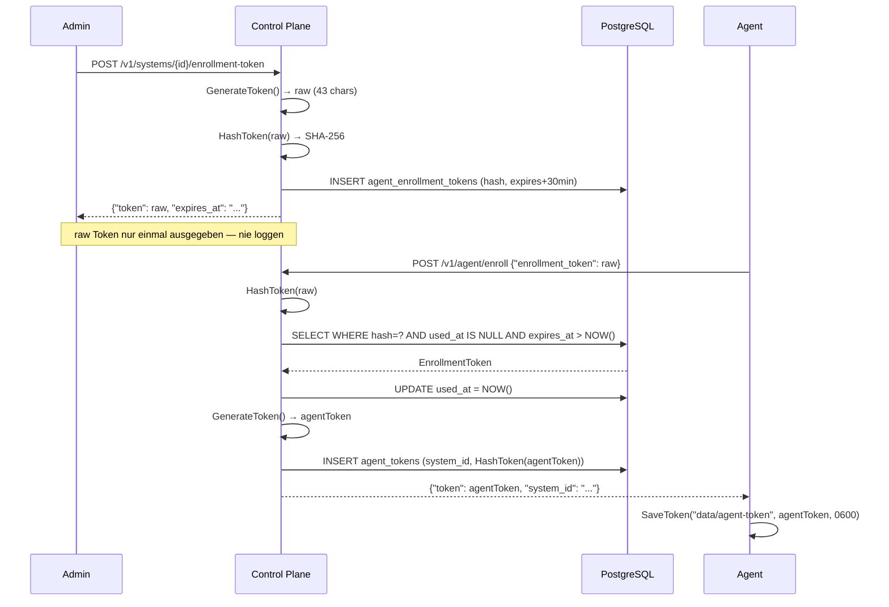
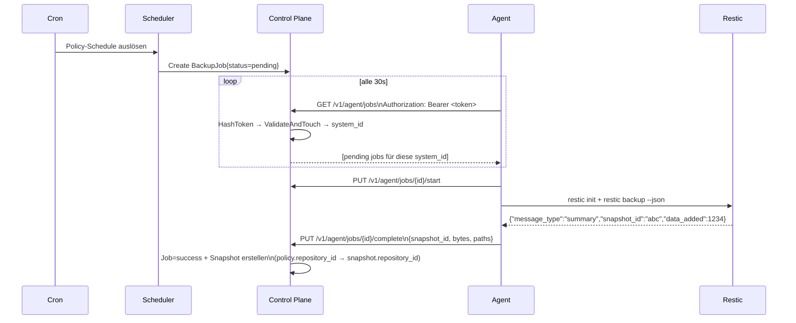
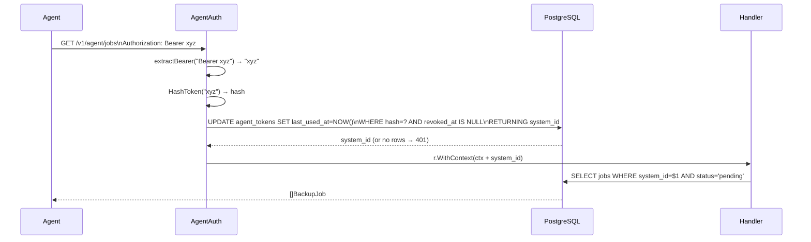
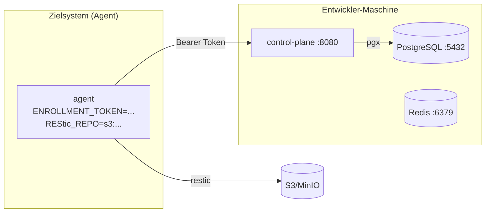
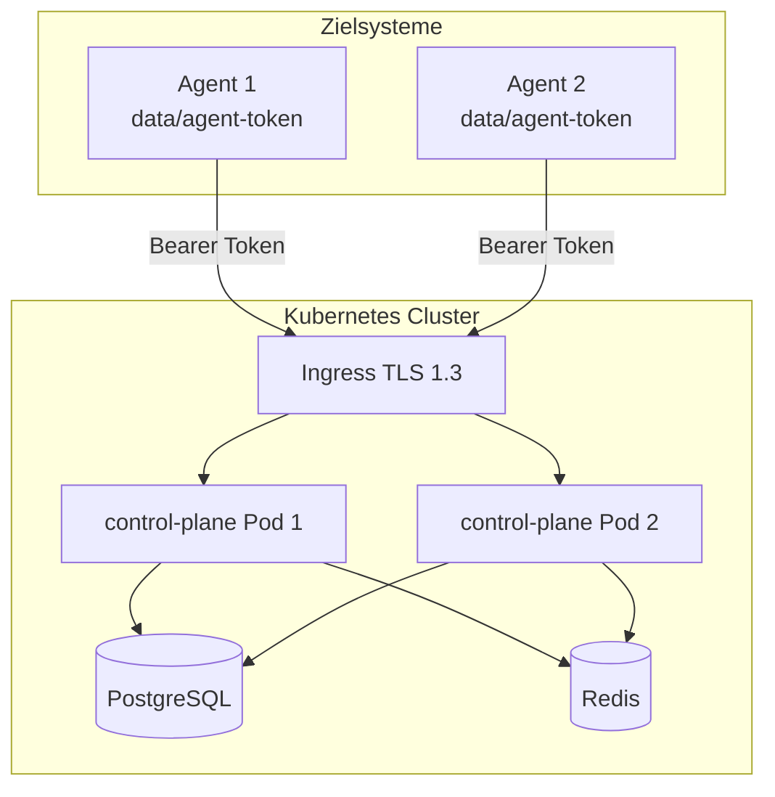

# UML — OpensourceBackup Diagramme

> Aktuelle Diagramme in Mermaid-Syntax.
> Stand: B1–B9.7 implementiert.

---

## 1. Komponentendiagramm — Gesamtsystem

---

## 2. Klassendiagramm — Catalog Models

---

## 3. Klassendiagramm — Auth Models

---

## 4. Klassendiagramm — Agent (DIP)

---

## 5. Sequenzdiagramm — Enrollment Flow

---

## 6. Sequenzdiagramm — Gesicherter Backup-Flow

---

## 7. Sequenzdiagramm — AgentAuth Middleware

---

## 8. Deploymentdiagramm — Entwicklung

---

## 9. Deploymentdiagramm — Produktion (Ziel)

