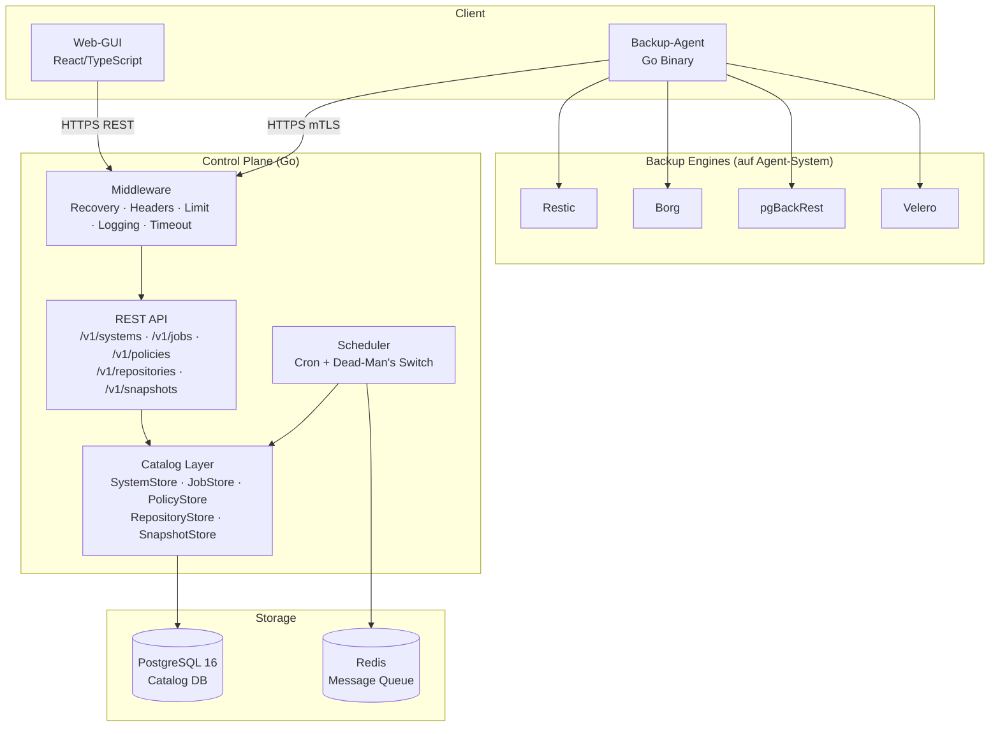
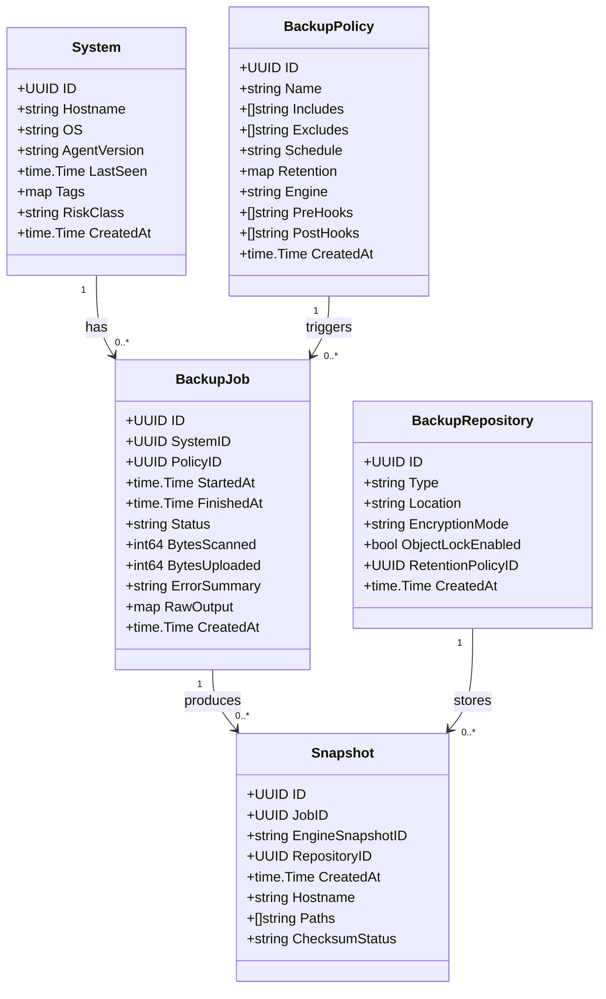
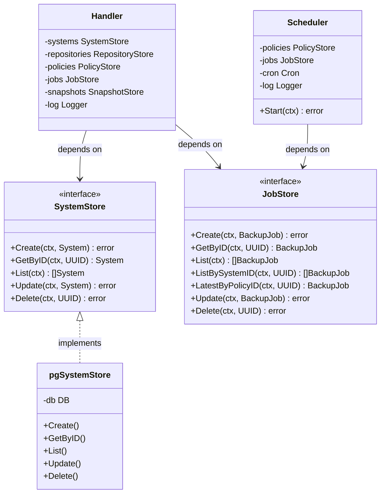
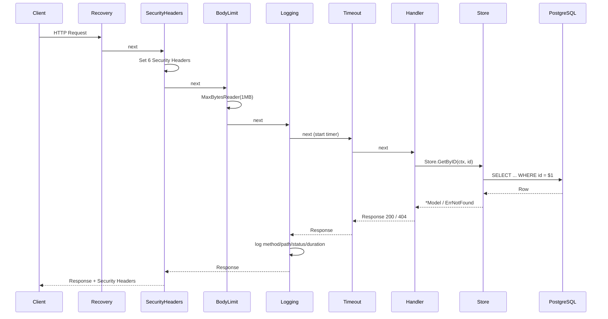
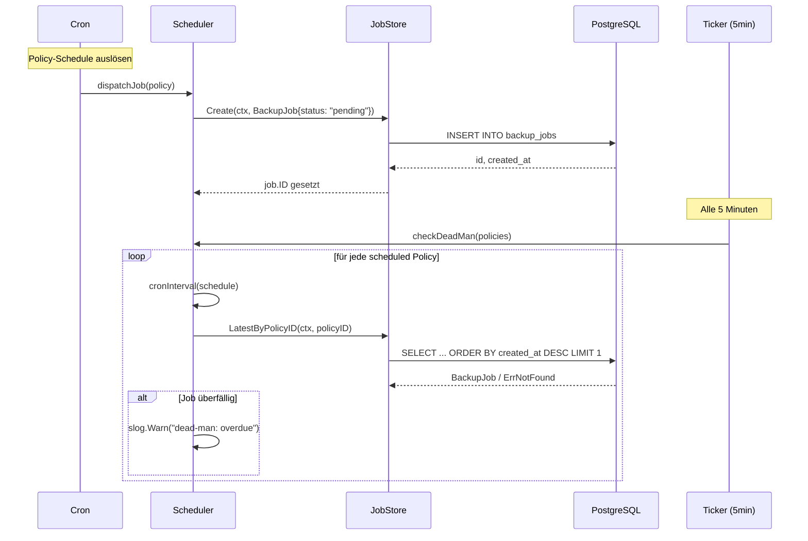
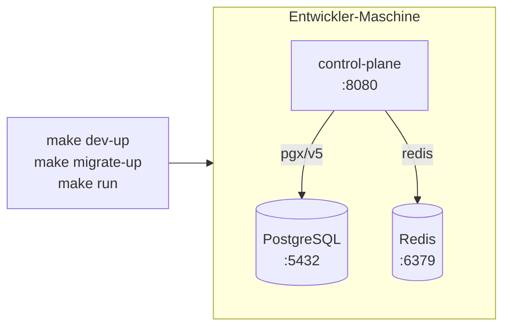
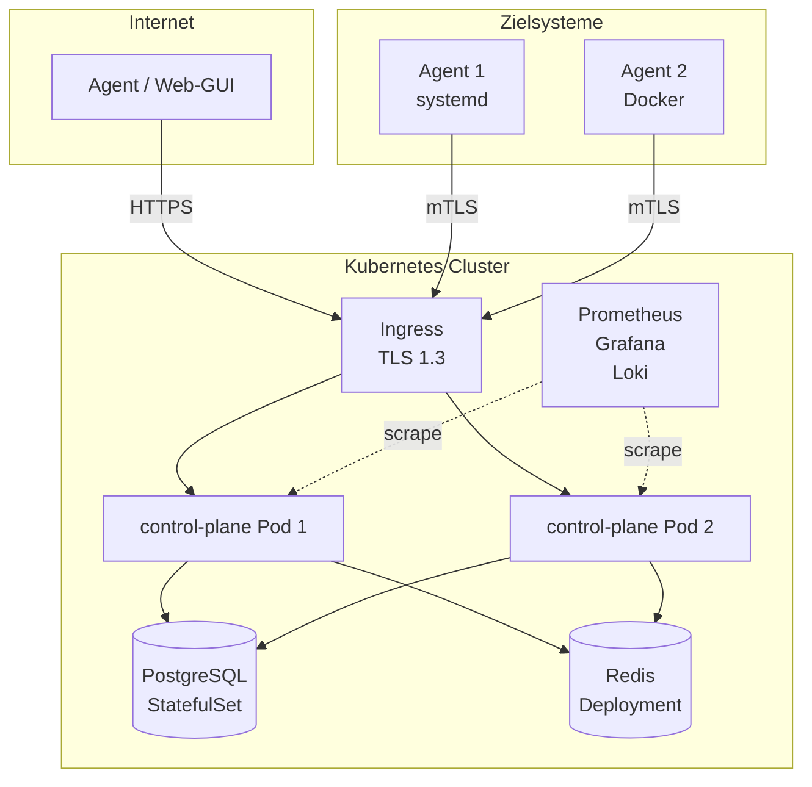

# UML — OpensourceBackup Diagramme

> Aktuelle Diagramme in Mermaid-Syntax.
> Stand: B1–B7 implementiert.

---

## 1. Komponentendiagramm — Gesamtsystem

---

## 2. Klassendiagramm — Catalog Models

---

## 3. Klassendiagramm — Store Interfaces (DIP)

---

## 4. Sequenzdiagramm — API Request (mit Middleware-Chain)

---

## 5. Sequenzdiagramm — Scheduled Job Dispatch

---

## 6. Deploymentdiagramm — Entwicklung

---

## 7. Deploymentdiagramm — Produktion (Ziel)

